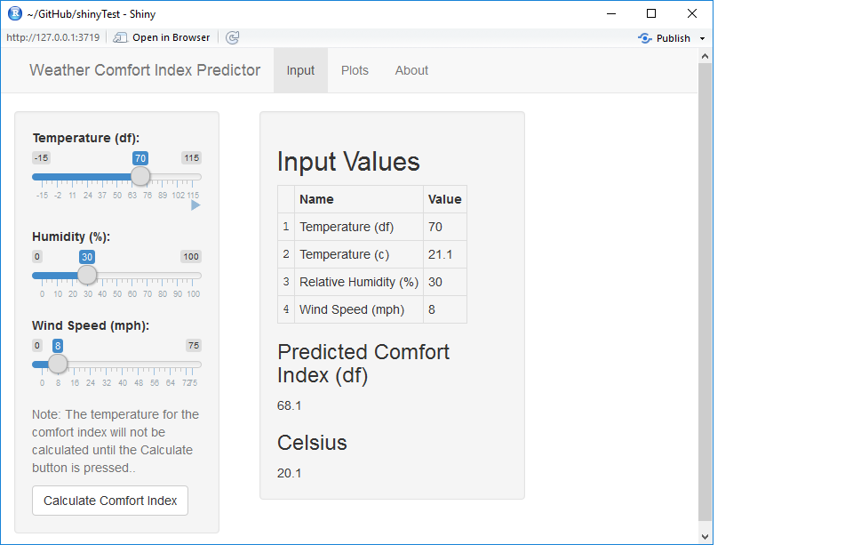
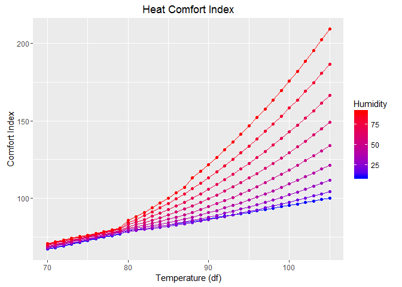

# Weather Comfort Index Calculator
Bill Holst  
May 28, 2016  


## Overview of the Weather Comfort Calculator

There are numerous calculators available on the web that give you either a heat or a wind chill index. 

The goal of this project is to:

 - Allow calculation of weather comfort index in a single input form with three parameters:
     - temperature (df)
     - relative humidity (%)
     - wind speed (mph)
 - Provide a simple, intuitive user interface
 - Combine existing, proven algorithms to produce result 
 - Produce plots of both heat and wind chill indexes


## Design of the Algorithm

The design in pseudo-R code is as follows:

```r
comfortIndex = function(temperature,relativeHumidty,windSpeed) {
    if (temperature<=40) {ci = windChill (temperature,windSpeed) }
    else {ci =heatIndex (Temperature,relativeHumidity)}
    ci
}    
```

- WindChill function is derived from the National Weather Service (NWS) with description found at http://www.srh.noaa.gov/ffc/?n=wci
- heatIndex function and overall algorithm design is located at: http://www.ncbi.nlm.nih.gov/pmc/articles/PMC3801457/figure/f3/
- Does not address wind cooling at high temperatures or high humidity at low temperatures

## User Interface



## Sample Plot - Heat Index



